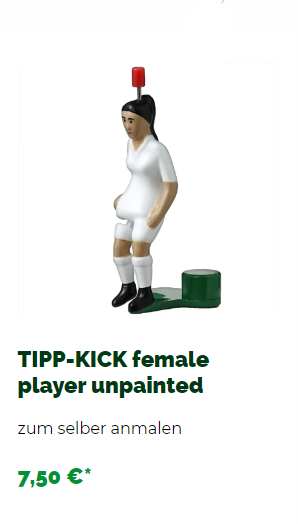

# TIPP-KICK FEMALE PLAYER bemalen

## Material

+ Revell Farbe
+ Pinsel
+ eventuell Verdünner

<https://www.tipp-kick.de/Weitere-Artikel/Do-it-yourself/female-player-unpainted.html>

<https://www.tipp-kick.de/Weitere-Artikel/Do-it-yourself/Email-Farbe-glaenzend.html>

<https://www.tipp-kick.de/Weitere-Artikel/Do-it-yourself/Email-Farbe-seidenmatt.html>

<https://www.tipp-kick.de/Weitere-Artikel/Do-it-yourself/Email-Farbe-metallic.html>

